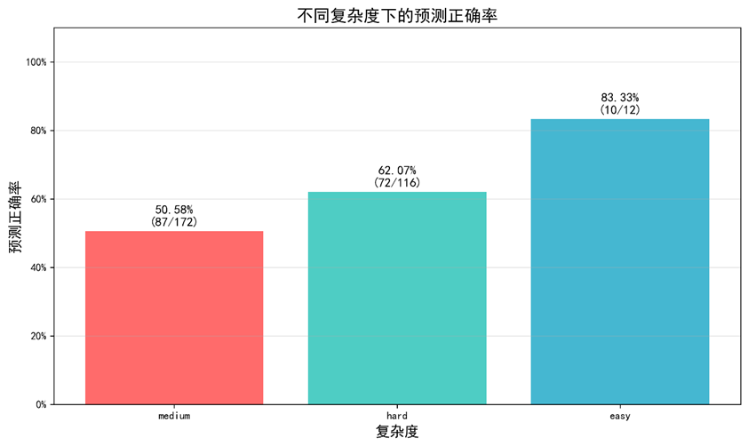
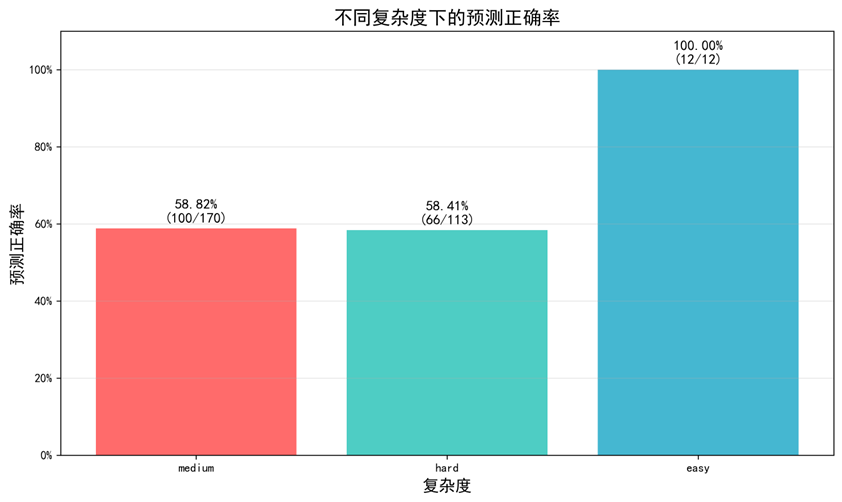
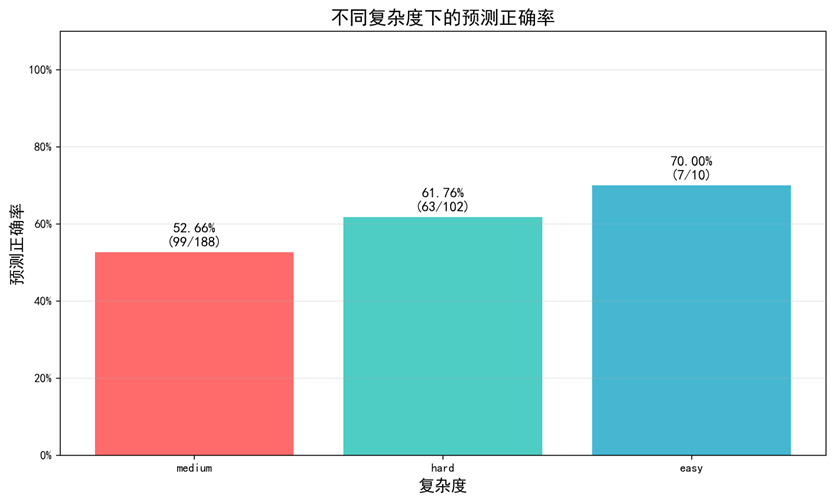
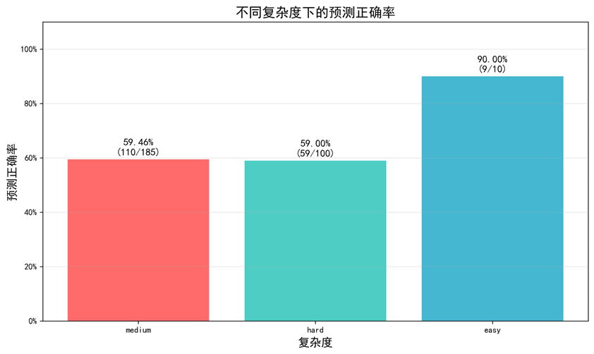

在原DEFAME代码基础上进行修改，通过结合MDAgents的Adaptive结构，来提点并减少token使用和早停等等

## 1. 复杂度分类
参考MDAgents中对多模态的医疗决策问题进行复杂度分类，创建`classify.py`文件并在common.label中添加新的枚举类`DifficultyLabel`以及对于的描述`DEFAULT_DIFFICULTY_DEFINITIONS`，用以表示问题的复杂度。

`classify.py`中实现了一个分类器Classifier，并结合了原DEFAME中的ezmm多模态序列类，将多模态事实检查claim作为输入，输出复杂度标签。这里默认多模态模型为GPT-4o。

### 1.1 DEFAULT_DIFFICULTY_DEFINITIONS V1

输入有图片

输入无图片

#### DifficultyLabel.EASY (简单)
"Verifiable through single reliable source or simple method. Content (text/image/video) is clear and straightforward, requiring no specialized knowledge."
"可通过单一可靠来源或简单方法进行验证。内容（文本/图片/视频）清晰直接，无需专业知识即可理解。"

#### DifficultyLabel.MEDIUM (中等)
"Requires cross-referencing multiple sources. Content may need detailed analysis, temporal/spatial context verification, or multimodal content correlation."
"需要交叉参考多个信息来源。内容可能需要进行详细分析、时空背景验证或多模态内容关联。"

#### DifficultyLabel.HARD (困难)
"Lacks reliable sources, has conflicting information, or requires specialized knowledge to analyze complex content relationships across text, visual, and contextual elements."
"缺乏可靠信息来源、存在矛盾内容，或需要专业知识来分析文本、视觉与语境元素之间的复杂关系。"

### 1.2 DEFAULT_DIFFICULTY_DEFINITIONS V3

输入有图片

输入无图片

#### DifficultyLabel.EASY (简单)
"""Claims with objective, factual content that can be verified through direct observation or single authoritative source. Requires basic reading comprehension and simple fact-checking skills.
**Characteristics:**  
- Directly observable facts (time, location, numbers, names)  
- Single-modality verification (text-only or image-only)  
- No background knowledge or specialized skills required  
- Clear and unambiguous answers, black-and-white distinctions
"""

"客观事实性内容，可通过直接观察或单一权威来源验证。仅需基本阅读理解和简单的事实核查技能。

**特征：**
- 直接可观察的事实（时间、地点、数字、人名）
- 单一模态验证（仅文本或仅图像）
- 无需背景知识或专业技能
- 答案明确无歧义，黑白分明
"

#### DifficultyLabel.MEDIUM (中等)
"""Claims requiring basic cross-referencing between multiple sources or simple multimodal content comparison. May need elementary reasoning or common knowledge context.
**Characteristics:**  
- Requires cross-verification from 2-3 information sources  
- Simple text-image consistency checks  
- Basic chronological or logical reasoning  
- Requires common sense knowledge but no specialized skills  
- May involve minor information incompleteness
"""

"需要多个信息源的基本交叉验证或简单的多模态内容比对。可能需要初级推理或常识性背景知识。

**特征：**
- 需要2-3个信息源相互验证
- 简单的文本-图像一致性检查
- 基本的时间顺序或逻辑关系判断
- 需要常识性知识但无需专业技能
- 可能存在轻微的信息不完整
"

#### DifficultyLabel.HARD (困难)
"""Claims involving complex reasoning, conflicting evidence, deep domain expertise, or sophisticated manipulation detection. Requires advanced analytical skills and comprehensive evaluation frameworks.
**Characteristics:**  
- Requires in-depth knowledge of specialized fields  
- Involves contradictory or severely incomplete evidence  
- Complex multimodal content tampering detection  
- Requires integration of multiple analytical dimensions and evaluation frameworks  
- Involves complex causal chains or reasoning networks
"""

"涉及复杂推理、矛盾证据、深度专业知识或复杂篡改检测。需要高级分析技能和综合评估框架。

**特征：**
- 需要专业领域深度知识
- 存在相互矛盾或严重不完整的证据
- 复杂的多模态内容篡改检测
- 需要综合多个分析维度和评估框架
- 涉及复杂的因果链或推理网络
"

## 2. 修改**CR+**的`benchmark.py`
针对数据集**claimreview2024+**，原数据加载已经实现claim的定义，在此基础上，将分类器集成在benchmark中，初始化会判断是否需要复杂度分类，如果原json中有了difficulty字段，则直接加载，否则通过分类器进行预测并将预测结果存入json，方便下次使用。

## Adaptive Frame 1

### Easy

针对easy类型，在label中的描述为`"Verifiable through single reliable source or simple method. Content (text/image/video) is clear and straightforward, requiring no specialized knowledge."`。被判断为easy的claim通过简单的方法就能判断。
planner->summarize->judge 删除develop 改成最大迭代次数2
本质上和原来的defame流程是一样的，因为简单，planner也会直接选择最简单的工具，也不会太多迭代，也不太需要develop。

### Medium

将develop+judge阶段改成MAD即多智能体辩论

### Hard
复杂的结果不能summarize，会导致很多重要信息丢失，需要让group去关注各自的视角和问题。

planner指定工具执行并获取相关信息之后，leader将分配任务目标给各个group然后各个group根据获取到的信息执行各自的task，最后leader汇总结果。替换的是summarize+develop+judge

## Adaptive Frame 2

这个分级体系主要考虑了**验证复杂度**、**所需资源**、**专业知识要求**和**内容分析难度**四个维度。